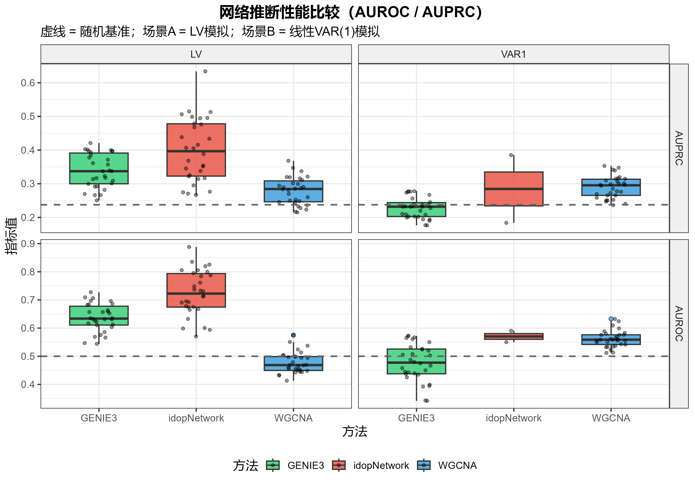
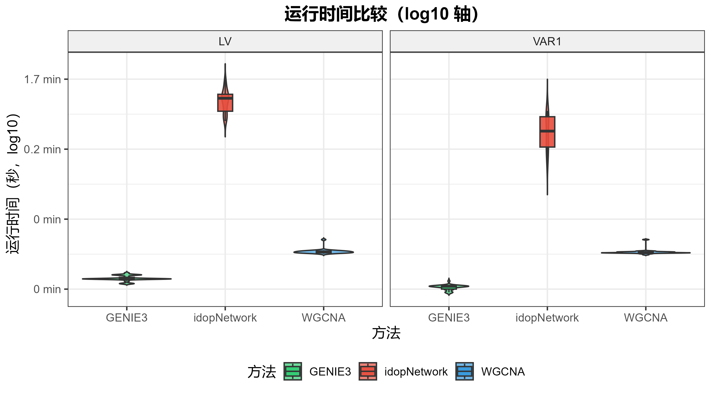

# idopNetwork-benchmark

A simulation study benchmarking three ecological network inference methods:
**idopNetwork**, **WGCNA**, and **GENIE3**.

---

## Background

Reconstructing ecological interaction networks from observational abundance data is a central challenge in community ecology. Three representative approaches cover different mechanistic assumptions:

| Method | Underlying model | Output | Direction |
|--------|-----------------|--------|-----------|
| **idopNetwork** | Quasi-dynamic Lotka-Volterra ODE + adaptive LASSO | Weighted directed signed network | Yes |
| **WGCNA** | Pearson correlation + Topological Overlap Measure (TOM) | Weighted undirected network | No |
| **GENIE3** | Random forest variable importance | Weighted directed network | Yes |

**idopNetwork** is designed specifically for ODE-based ecological dynamics and can recover both the direction and sign (positive/negative) of species interactions. WGCNA is a widely-used co-expression network approach adapted here for microbiome/ecological data. GENIE3, originally a gene regulatory network method, provides a machine-learning baseline for directed inference.

---

## Experiment Design

### Simulation scenarios

Two data-generating processes are evaluated to test performance under matched and mismatched model assumptions:

**Scenario A — Lotka-Volterra (LV)**
Abundance trajectories are simulated from a multi-species generalized LV ODE:

$$\frac{dx_i}{dt} = r_i x_i + \sum_j B_{ij} x_i x_j$$

This scenario favors idopNetwork, whose pipeline was designed for exactly this class of dynamics.

**Scenario B — Linear VAR(1)**
Abundance follows a first-order vector autoregressive process:

$$X_t = B \cdot X_{t-1} + \varepsilon_t, \quad \varepsilon_t \sim \mathcal{N}(0, \sigma^2 I)$$

This scenario has no ODE structure, providing a stress test for idopNetwork and a more favorable setting for WGCNA and GENIE3.

### Ground-truth network

A single sparse directed interaction matrix **B** (20 × 20 species, ~25% non-zero off-diagonal entries, weights ∈ [−0.5, 0.5]) is used across all replicates. `B[i, j] ≠ 0` means species *j* regulates species *i*.

### Parameters

```
N_SPECIES     = 20       # number of species
N_POSITIONS   = 30       # gradient positions (sample size)
SPARSITY_FRAC = 0.25     # fraction of non-zero off-diagonal entries
EDGE_STRENGTH = [-0.5, 0.5]  # uniform range for interaction weights
NOISE_SD      = 0.10     # log-scale additive noise
IDOP_MAXIT    = 1000     # max ODE optimizer iterations per species
MASTER_SEED   = 42
```

### Evaluation metrics

All methods produce a score matrix `S[regulator, target]`; scores are compared against the binary ground truth via:

| Metric | Description | Applicable methods |
|--------|-------------|-------------------|
| **AUROC** | Area under ROC curve (edge existence) | All |
| **AUPRC** | Area under precision-recall curve | All |
| **Direction accuracy** | Fraction of true edges where `S[from,to] > S[to,from]` | idopNetwork, GENIE3 |
| **Sign accuracy** | Fraction of true edges with correct positive/negative sign | idopNetwork only |
| **Runtime** | Wall-clock seconds | All |

Random baselines: AUROC = 0.5; AUPRC ≈ 0.24 (positive rate ≈ 25% × 19/20).

---

## Repository Structure

```
idopNetwork-benchmark/
├── idopnetwork/               # idopNetwork R package source (cloned from cxzdsa2332/idopNetwork)
│   ├── R/
│   ├── man/
│   ├── data/
│   ├── DESCRIPTION
│   └── ...
└── simulation/
    ├── config.R               # All tunable parameters
    ├── 01_simulate_lv.R       # Scenario A: Lotka-Volterra ODE simulation
    ├── 02_simulate_linear.R   # Scenario B: linear VAR(1) simulation
    ├── 03_run_idopnetwork.R   # idopNetwork wrapper (sequential, avoids parallel cluster issues)
    ├── 04_run_wgcna.R         # WGCNA wrapper (auto soft-threshold)
    ├── 05_run_genie3.R        # GENIE3 wrapper
    ├── 06_evaluate.R          # AUROC, AUPRC, direction accuracy, sign accuracy
    ├── 07_visualize.R         # ggplot2 figures and summary table
    ├── run_all.R              # Main orchestrator with checkpoint/resume
    ├── results/
    │   ├── final_results.csv  # Per-replicate metrics (all methods × scenarios)
    │   └── summary_table.csv  # Mean ± SD across replicates
    └── figures/
        ├── fig1_auroc_auprc.png
        ├── fig2_runtime.png
        └── fig3_direction_sign.png
```

---

## Installation

### 1. Install idopNetwork from local source

```r
devtools::install_local("idopnetwork/")
```

### 2. Install other dependencies

```r
# Bioconductor
if (!requireNamespace("BiocManager", quietly = TRUE))
  install.packages("BiocManager")
BiocManager::install(c("WGCNA", "GENIE3"))

# CRAN
install.packages(c("deSolve", "pROC", "PRROC", "ggplot2", "doRNG"))
```

---

## Running the Simulation

```r
setwd("path/to/idopNetwork-benchmark")
source("simulation/run_all.R")
```

The script saves a checkpoint after each replicate (`simulation/results/checkpoint.rds`) so interrupted runs can be resumed automatically.

To change the number of replicates or other parameters, edit `simulation/config.R` before running.

---

## Results (2-replicate pilot)

A pilot run with 2 Monte Carlo replicates was completed to validate the full pipeline.

### AUROC / AUPRC



### Runtime comparison



### Direction and sign accuracy


Key observations from the pilot run:

- **idopNetwork** achieves AUROC above the random baseline (0.5) in the LV scenario, consistent with its design assumptions. Performance degrades in the VAR(1) scenario where the ODE model is misspecified.
- **WGCNA** is fast (< 3 s) but produces an undirected network; direction accuracy is ~0.5 by construction.
- **GENIE3** is fast (< 1 s) and provides directional inference; competitive AUROC in the VAR(1) scenario.
- **Runtime**: idopNetwork is 50–150× slower than WGCNA/GENIE3 due to per-species ODE optimization.

> **Note**: 2 replicates are insufficient for stable statistical conclusions. These results are a pipeline validation only. A full study should use ≥ 25 replicates.

---

## Implementation Notes

### idopNetwork pipeline

The wrapper in `03_run_idopnetwork.R` uses sequential `lapply` over species instead of `qdODE_parallel()`. The parallel version fails because `parLapply` cannot correctly serialize the closure containing the `pfit` list in this environment, causing `$ operator is invalid for atomic vectors` errors in worker processes.

`network_conversion()` returns a matrix (not a data frame) when a species has exactly one regulator; the wrapper coerces it with `as.data.frame()` before accessing `$Effect`.

### Score matrix convention

All methods output `score_mat[regulator, target]`, matching the ground truth convention where `B_true[target, regulator] ≠ 0` means `regulator → target`.

---

## Citation

If you use idopNetwork, please cite the original package:

> [idopNetwork on GitHub](https://github.com/cxzdsa2332/idopNetwork)

---

## License

Simulation scripts in `simulation/` are released under MIT License.
The `idopnetwork/` subdirectory retains its original license.
