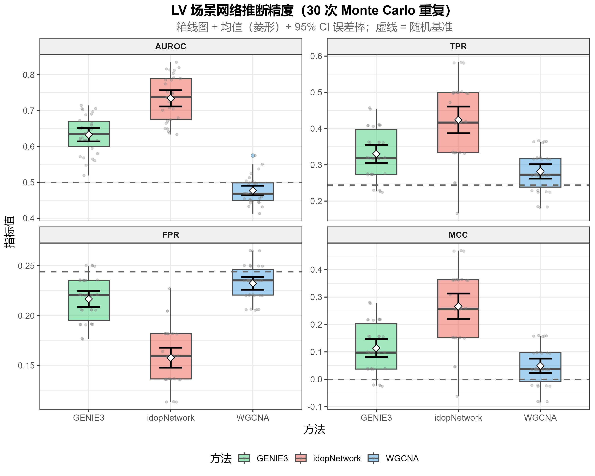
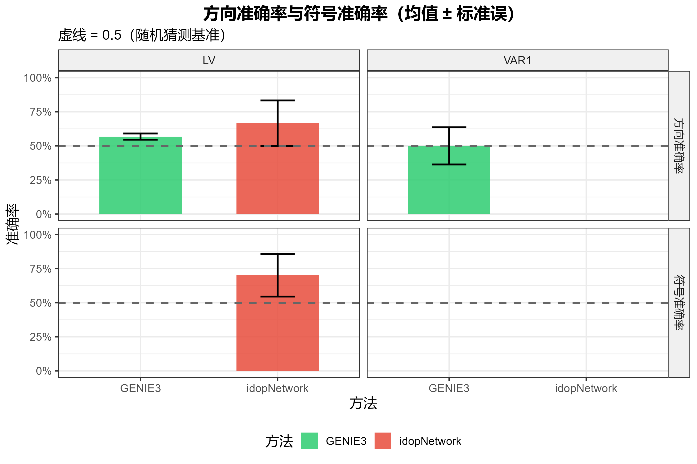
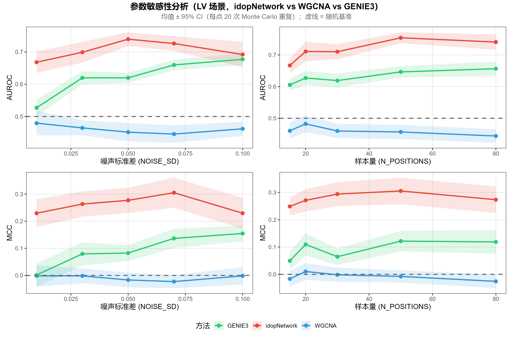

# idopNetwork-benchmark

A Monte Carlo simulation study benchmarking three ecological network inference methods under Lotka-Volterra dynamics: **idopNetwork**, **WGCNA**, and **GENIE3**.

---

## Background

Reconstructing ecological interaction networks from observational abundance data is a central challenge in community ecology. Three representative approaches cover different mechanistic assumptions:

| Method | Underlying model | Output type | Direction | Sign |
|--------|-----------------|-------------|-----------|------|
| **idopNetwork** | Quasi-dynamic Lotka-Volterra ODE + adaptive LASSO | Weighted directed signed | Yes | Yes |
| **WGCNA** | Pearson correlation + Topological Overlap Measure | Weighted undirected | No | No |
| **GENIE3** | Random forest variable importance | Weighted directed | Yes | No |

**idopNetwork** is designed for ODE-based ecological dynamics and uniquely recovers both the **direction** and **sign** (positive/negative) of species interactions. This benchmark evaluates whether that model-data alignment translates into measurable performance gains under LV-generated data.

---

## Experiment Design

### Data generation — Lotka-Volterra ODE

Abundance trajectories are simulated from a multi-species generalized LV equation:

$$\frac{dx_i}{dt} = r_i x_i + \sum_j B_{ij}\, x_i x_j, \qquad i = 1,\ldots,S$$

where $r_i \sim \text{Uniform}(0.1, 0.5)$, $x_i(0) \sim \text{Uniform}(0.5, 2.0)$, solved with `deSolve::lsoda`. Log-scale Gaussian noise ($\sigma = 0.05$) is added at each gradient position.

### Ground-truth network

A single sparse directed interaction matrix **B** (10 × 10 species, 25% non-zero off-diagonal entries, weights ∈ [−0.5, 0.5]) is used across all replicates. `B[target, regulator] ≠ 0` means species *regulator* → species *target*.

### Main experiment parameters

```
N_SPECIES     = 10      # number of species
N_POSITIONS   = 30      # gradient positions (sample size)
N_REPLICATES  = 30      # Monte Carlo replicates
NOISE_SD      = 0.05    # log-scale additive Gaussian noise
SPARSITY_FRAC = 0.25    # fraction of non-zero off-diagonal entries
EDGE_STRENGTH = [-0.5, 0.5]
MASTER_SEED   = 42
```

### Parameter sensitivity sweep

Two additional sweep lines (20 replicates each) test robustness:

- **Noise sweep**: NOISE_SD ∈ {0.01, 0.03, 0.05, 0.07, 0.10}, fixed N_POSITIONS = 30
- **Sample size sweep**: N_POSITIONS ∈ {15, 20, 30, 50, 80}, fixed NOISE_SD = 0.05

### Evaluation metrics

All methods produce a score matrix `S[regulator, target]` compared against the binary ground truth:

| Metric | Description |
|--------|-------------|
| **AUROC** | Area under ROC curve — overall edge detection (threshold-free) |
| **AUPRC** | Area under precision-recall curve (threshold-free) |
| **MCC** | Matthews correlation coefficient at top-*k* threshold (*k* = true edge count = 22) |
| **Direction accuracy** | Fraction of true edges where `S[i→j] > S[j→i]`; idopNetwork and GENIE3 only |
| **Sign accuracy** | Fraction of true edges with correct +/− sign; idopNetwork only |

Random baselines: AUROC = 0.5, AUPRC ≈ 0.244, MCC ≈ 0, direction accuracy = 0.5.

> **Note on MCC**: the top-*k* threshold uses the true edge count, which is only available in simulations. AUROC and AUPRC are preferred for real-data benchmarks.

---

## Results (30 Monte Carlo replicates)

### Edge detection (Table 1)

| Method | AUROC | AUPRC | MCC |
|--------|-------|-------|-----|
| **idopNetwork** | **0.734 ± 0.063** | **0.397 ± 0.075** | **0.266 ± 0.131** |
| GENIE3 | 0.633 ± 0.053 | 0.332 ± 0.056 | 0.114 ± 0.092 |
| WGCNA | 0.477 ± 0.038 | 0.279 ± 0.041 | 0.049 ± 0.073 |



### Direction and sign accuracy

| Method | Direction accuracy | Sign accuracy |
|--------|--------------------|---------------|
| **idopNetwork** | **0.718 ± 0.094** | 0.466 ± 0.159 |
| GENIE3 | 0.533 ± 0.094 | — |
| WGCNA | — (undirected) | — |



### Parameter sensitivity (Fig. 4)



idopNetwork maintains its AUROC and MCC advantage across the full noise range (0.01–0.10) and all tested sample sizes (15–80). Performance degrades at very low sample size (N < 20) where ODE fitting becomes unstable.

---

## Repository Structure

```
idopNetwork-benchmark/
├── REPORT.md                      # Full methods, results, and discussion (Chinese)
├── REPORT.pdf                     # PDF version of the report
├── idopnetwork/                   # idopNetwork R package source
└── simulation/
    ├── config.R                   # All tunable parameters
    ├── 01_simulate_lv.R           # LV ODE simulation
    ├── 03_run_idopnetwork.R       # idopNetwork wrapper (sequential per-species)
    ├── 04_run_wgcna.R             # WGCNA wrapper (auto soft-threshold)
    ├── 05_run_genie3.R            # GENIE3 wrapper
    ├── 06_evaluate.R              # AUROC, AUPRC, MCC, direction/sign accuracy
    ├── 07_visualize.R             # Figures 1–3
    ├── 08_plot_curves.R           # ROC / PR curve panels
    ├── 09_plot_sweep.R            # Figure 4: sensitivity analysis
    ├── run_all.R                  # Main orchestrator (checkpoint/resume)
    ├── run_sweep.R                # Parameter sensitivity sweep
    ├── results/
    │   ├── final_results.csv      # Per-replicate metrics (main experiment)
    │   ├── summary_table.csv      # Mean ± SD across replicates
    │   └── sweep_results.csv      # Sensitivity sweep results
    └── figures/
        ├── fig1_metrics_combined.png   # AUROC / AUPRC / MCC bar charts
        ├── fig3_direction_sign.png     # Direction and sign accuracy
        └── fig_sensitivity.png          # Noise × sample-size sensitivity
```

---

## Installation

### 1. Install idopNetwork from local source

```r
devtools::install_local("idopnetwork/")
```

### 2. Install other R dependencies

```r
if (!requireNamespace("BiocManager", quietly = TRUE))
  install.packages("BiocManager")
BiocManager::install(c("WGCNA", "GENIE3"))

install.packages(c("deSolve", "pROC", "PRROC", "ggplot2", "patchwork", "cowplot"))
```

---

## Running the Simulation

### Main experiment (≈ 1–2 hours)

```r
setwd("path/to/idopNetwork-benchmark")
source("simulation/run_all.R")
```

Saves a checkpoint after each replicate (`simulation/results/checkpoint.rds`); interrupted runs resume automatically.

### Parameter sensitivity sweep (≈ 20–40 min)

```r
source("simulation/run_sweep.R")
```

### Regenerate all figures

```r
source("simulation/07_visualize.R")
cfg <- list(OUT_DIR = "simulation/results", FIG_DIR = "simulation/figures")
make_all_figures(cfg)

source("simulation/09_plot_sweep.R")
plot_sweep(cfg)
```

---

## Implementation Notes

### idopNetwork wrapper

`03_run_idopnetwork.R` uses sequential `lapply` over species instead of `qdODE_parallel()`. The parallel version fails because `parLapply` cannot serialize the closure containing the `pfit` list, causing worker-process errors. Sequential execution adds overhead but ensures reproducibility.

`network_conversion()` returns a matrix (not a data frame) when a species has exactly one regulator; the wrapper coerces with `as.data.frame()` before accessing `$Effect`.

### Score matrix convention

All methods output `score_mat[regulator, target]`, matching the ground-truth convention `B_true[target, regulator] ≠ 0` → regulator → target edge.

---

## Citation

If you use idopNetwork, please cite the original package:

> [idopNetwork — cxzdsa2332/idopNetwork](https://github.com/cxzdsa2332/idopNetwork)

---

## License

Simulation scripts in `simulation/` are released under the MIT License.  
The `idopnetwork/` subdirectory retains its original license.
